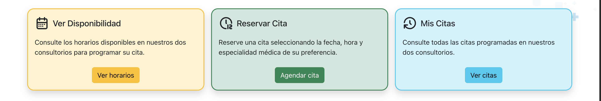
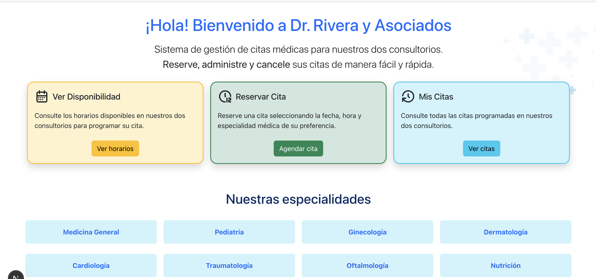
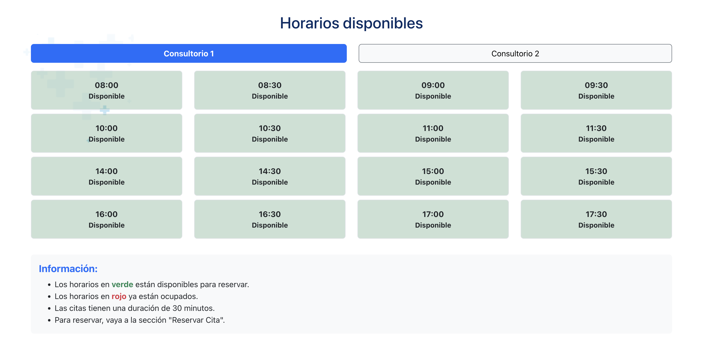
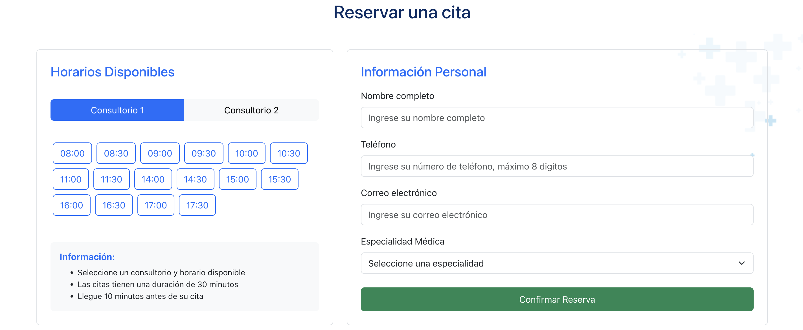
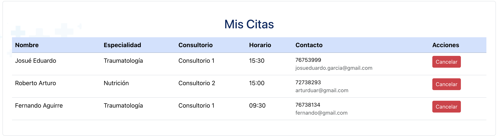

# Josué Eduardo García Estrada | GE240098
## Desafio 01 - Diseño y Programación de Software Multiplataforma

### Descripción del problema a solucionar

En este desafío Desarrolle una aplicación en React con Next.js, utilizando UseState para la gestión del estado y Bootstrap para la interfaz, que permita a los usuarios programar y administrar citas médicas en una clínica.

### Comandos para ejecutar el proyecto
`
git clone https://github.com/JosueGarcia-UDB/desafio_01
cd desafio_01/
npm i
npm run dev
`
💻 Abrir el proyecto en el localhost:3000

---
### Lista de componentes realizados
1. **CardCitas.jsx** -> Componente para las cardas que están dentro del componente Information.jsx 

2. **Footer.jsx** -> Componente con el pie de página.
3. **Header.jsx** -> Componente con el logo y enlaces del sitio.
4. **Information.jsx** -> Componente con el inicio de la aplicación.

5. **ListaHorarios.jsx** -> Componente con los horarios disponibles en ambos consultorios.

6. **FormularioCita.jsx** -> Componente con los horarios disponibles y formulario para agregar una nueva cita.

7. **ResumenCitas.jsx** -> Componente con las citas registradas por el usuario.

